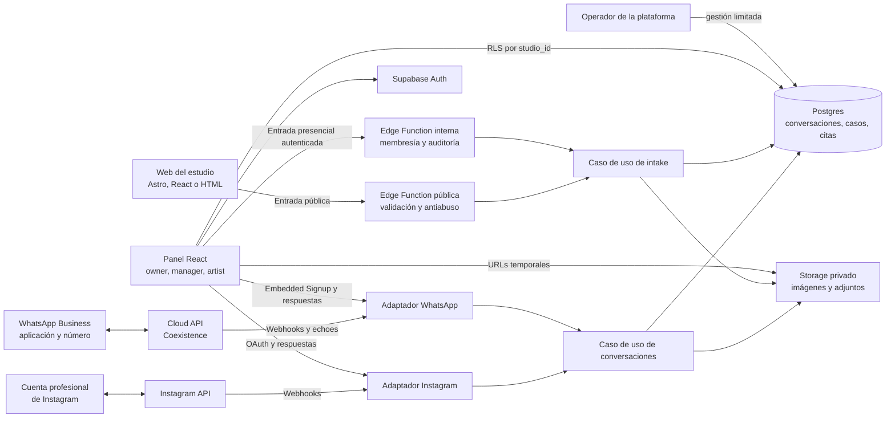

# Decisión de plataforma: backend gestionado con salida a self-hosting

_Estado: aceptada_

_Última actualización: 2026-08-30_

_La fuente de verdad para la arquitectura por fases es [Especificación del MVP vendible](../product/sellable-mvp-spec.md). La integración directa con Meta descrita más abajo queda como fallback de la fase conectada, no como dependencia del MVP inicial._

## Decisión

Construir el MVP sobre **Supabase Cloud** usando un único proyecto multi-tenant, con React y TypeScript para el panel. Mantener las webs públicas independientes: Astro sigue siendo una buena opción para webs de contenido y rendimiento, pero se conectarán mediante un formulario o web component agnóstico del framework.

En el MVP, dos entradas crean casos: un endpoint público para las webs y una operación autenticada para la captura presencial. El núcleo vendible no depende de Instagram, WhatsApp ni de aprobación de Meta.

Para la fase conectada, **Chatwoot es la primera opción como motor de conversaciones** mediante API y webhooks, con un espacio aislado por estudio y Supabase como fuente de verdad del dominio de tatuaje. Esta elección queda condicionada a un spike que confirme Instagram, WhatsApp Business Coexistence, adjuntos, aislamiento, API, licenciamiento y coste. Si no lo supera, los adaptadores directos de Meta descritos en este documento son el fallback y conservarán el mismo puerto de aplicación.

No desplegar Supabase self-hosted durante la validación inicial. Conservar migraciones SQL, políticas y contratos en el repositorio para mantener una ruta realista de self-hosting posterior.

## Por qué Supabase

El dominio es relacional: estudios, membresías, artistas, clientes, casos, mensajes, recursos y citas. Postgres permite expresar esas relaciones y restricciones de agenda de forma directa. Supabase aporta sin construir desde cero:

- autenticación;
- Postgres y API;
- Row Level Security para aislamiento por estudio;
- almacenamiento privado de imágenes;
- realtime;
- funciones para la entrada pública y otras operaciones privilegiadas.

La seguridad multi-tenant depende de políticas RLS y grants comprobados. Cada tabla expuesta debe tener pruebas de allow/deny; una columna `studio_id` sin políticas no constituye aislamiento.

## Cloud frente a self-hosted

### Empezar en cloud

Ventajas:

- permite dedicar el tiempo al producto y no a TLS, backups, SMTP, monitorización, actualizaciones y escalado;
- ofrece backups y operación gestionada según el plan;
- reduce el riesgo durante los primeros estudios;
- mantiene una única plataforma para autenticación, datos e imágenes.

Se debe usar un único proyecto para el SaaS y aislar estudios con RLS. Crear un proyecto por estudio multiplicaría coste y mantenimiento sin necesidad en esta etapa.

### Considerar self-hosting cuando exista un motivo

Reevaluar si aparece alguno de estos disparadores:

- un contrato exige control específico de ubicación o infraestructura;
- existe capacidad DevOps para operar y responder por backups, seguridad y disponibilidad;
- el coste medido del servicio gestionado supera de forma sostenida el coste total de operación propia;
- un cliente exige una instancia dedicada y paga esa complejidad.

Self-hosted no significa automáticamente más barato. Supabase completo requiere varios servicios además de Postgres y su configuración segura forma parte del producto operativo.

## Alternativas evaluadas

### Appwrite

Buena segunda opción si se prioriza conservar un modelo cercano a MongoDB o utilizar su mensajería integrada. Incluye Auth, Databases, Storage, Functions, Realtime y Messaging, y permite cloud o self-hosting.

No es la recomendación principal porque el modelo de negocio y permisos es fuertemente relacional. Además, la base subyacente se elige al instalar una instancia self-hosted y no se cambia después sin una migración explícita.

### MERN completo

Mantendría el stack conocido, pero obligaría a construir y operar autenticación, permisos multi-tenant, almacenamiento privado, URLs firmadas, recuperación de cuenta, auditoría y gran parte de la infraestructura. Es justamente el backend indiferenciado que se quiere evitar.

### Cal.com

No debe ser el backend del producto. Puede añadirse como motor de disponibilidad o sincronización cuando se confirme la necesidad de booking automático. Para tatuajes personalizados, la solicitud debe revisarse antes de reservar un bloque largo; por eso el MVP mantiene `tattoo_case` y `appointment` como conceptos separados.

### Astro

Astro es apropiado para las webs públicas, donde contenido, SEO y mínimo JavaScript importan. El panel es una aplicación operativa altamente interactiva; React como SPA reduce la fricción de estado compartido, filtros, agenda, subida de imágenes y actualizaciones en tiempo real.

## Arquitectura propuesta



## Adaptadores de mensajería de Meta

El dominio no depende de los SDK ni de los DTO de Meta. Cada adaptador traduce webhooks y respuestas al mismo contrato interno de conversación, conserva los identificadores externos necesarios para idempotencia y registra el estado real de cada envío.

- Autorización, renovación de tokens y envío de mensajes se ejecutan únicamente en backend.
- La cuenta o número conectado determina el estudio; ningún webhook confía en un studio_id aportado por el remitente.
- Instagram usa su API de mensajería y sus permisos específicos.
- WhatsApp usa Cloud API y Embedded Signup v4; Coexistence se habilita para números existentes elegibles.
- El adaptador de WhatsApp ingiere mensajes entrantes, estados y echoes enviados desde la aplicación, además del historial opcional autorizado durante el alta.
- Una conversación puede existir sin caso hasta que el equipo la clasifique.
- Las reglas temporales y permisos de Meta se evalúan antes de cada respuesta y sus rechazos se muestran al usuario.

## Límites de seguridad de las entradas

- La entrada pública identifica el estudio mediante una integración activa, aplica validación y antiabuso, y no acepta credenciales administrativas desde la web.
- La entrada presencial exige una sesión válida y deriva el estudio de una membresía autorizada; el cliente no elige el tenant mediante parámetros.
- El origen y el miembro creador quedan registrados. Un caso presencial no obtiene permisos adicionales ni se convierte automáticamente en cita.
- Los webhooks de Meta se verifican, se procesan de forma idempotente y resuelven el tenant desde una conexión activa almacenada.
- Los tokens de acceso se almacenan como secretos de backend, nunca se devuelven al navegador ni se escriben en logs.
- El envío saliente valida rol, pertenencia al estudio, ventana permitida y conversación destinataria antes de llamar a Meta.
- Si en el futuro se entrega físicamente la tablet al cliente, se diseñará un modo restringido que no exponga navegación ni datos de otros clientes. Ese modo kiosco no forma parte del primer slice confirmado.

## Componentes del repositorio

```text
apps/
  dashboard/            # Panel React/TypeScript
packages/
  intake-widget/        # Formulario o web component reutilizable
  contracts/            # Schemas y tipos compartidos
  integrations/
    meta-instagram/      # Adaptador, DTO externos y traducción a contratos internos
    meta-whatsapp/       # Cloud API, Coexistence y traducción a contratos internos
supabase/
  migrations/           # Esquema, constraints, grants y políticas RLS
  functions/public-intake/ # Entrada pública validada y limitada
  functions/staff-intake/  # Captura presencial autenticada
  functions/instagram-oauth/   # Conexión y callback de Meta
  functions/instagram-webhook/ # Recepción verificada e idempotente
  functions/whatsapp-signup/   # Embedded Signup v4 y conexión del número
  functions/whatsapp-webhook/  # Mensajes, estados, echoes e historial opcional
  tests/                # Pruebas de aislamiento y contratos de DB
```

## Modelo de datos inicial

- `studios`
- `profiles`
- `studio_memberships`
- `artist_profiles`
- `clients`
- `tattoo_cases`
- `conversations`
- `conversation_messages`
- `message_attachments`
- `case_notes`
- `case_media`
- `appointments`
- `appointment_deposits`
- `web_integration_keys`
- `channel_connections`
- `audit_events`

Todas las tablas de negocio llevan `studio_id`; las políticas derivan el acceso desde la membresía autenticada. Las conversaciones pueden tener client_id y case_id nulos mientras están pendientes de clasificar. Los recursos usan rutas aisladas por estudio y por conversación o caso en un bucket privado.

Cada conexión conserva proveedor, identificador externo de cuenta o número, estado, capacidades y referencias seguras a credenciales. Una restricción única por proveedor e identificador externo impide conectar el mismo activo a dos estudios.

Caso, cita y señal conservan estados independientes. Un caso puede tener varias citas; una cita con señal pendiente no se representa como confirmada. El primer slice registra la señal manualmente sin almacenar datos bancarios o de tarjeta.

## Slices técnicos por fases

1. Crear monorepo TypeScript y contratos del intake.
2. Añadir migraciones para estudios, membresías, artistas, clientes, casos, recursos, citas, señales y auditoría.
3. Escribir pruebas RED de RLS: miembro del estudio puede leer; usuario externo y anónimo no pueden.
4. Implementar el caso de uso de casos y sus dos entradas directas: web pública y captura presencial autenticada.
5. Probar que la entrada presencial deriva el estudio de la sesión y registra origen y creador.
6. Construir la bandeja de solicitudes, lista de casos, detalle y acción "Nuevo caso" adaptable a móvil/tablet.
7. Añadir imágenes privadas y URLs temporales.
8. Añadir citas, prevención de conflictos y vista "Hoy".
9. Añadir el registro manual de señales y sus estados sin procesar pagos.
10. Añadir notificaciones, búsqueda, exportación, monitorización y hardening móvil.
11. Validar el flujo completo con un estudio piloto y corregir los bloqueos para cobrar.
12. Ejecutar el spike de Chatwoot con Instagram y WhatsApp Business Coexistence.
13. Implementar la fase conectada usando Chatwoot o, si no supera el spike, los adaptadores directos de Meta.

El alta como Tech Provider y las revisiones de Meta deben iniciarse con antelación suficiente para la fase conectada, pero no bloquean el MVP web + workspace ni su primer piloto comercial.

## Fuentes técnicas consultadas

- https://supabase.com/docs/guides/auth
- https://supabase.com/docs/guides/database/postgres/row-level-security
- https://supabase.com/docs/guides/self-hosting/docker
- https://supabase.com/pricing
- https://appwrite.io/docs/advanced/self-hosting
- https://astro.build/
- https://tattoopro.io/scheduling
- https://developers.facebook.com/docs/instagram-platform/instagram-api-with-instagram-login/messaging-api
- https://developers.facebook.com/documentation/business-messaging/whatsapp/about-the-platform
- https://developers.facebook.com/documentation/business-messaging/whatsapp/messages/send-messages
- https://developers.facebook.com/documentation/business-messaging/whatsapp/embedded-signup/onboarding-business-app-users
