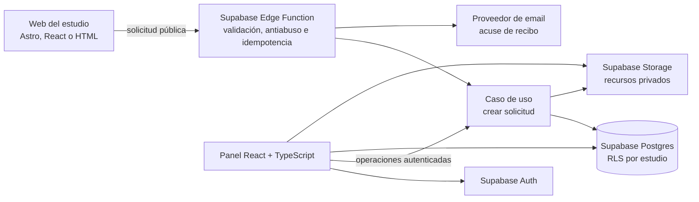

# Especificación del producto: web + workspace para estudios de tatuaje

_Estado: fuente de verdad para alcance y fases_

_Última actualización: 2026-08-30_

_La fase anterior al desarrollo se define en [Plan de validación y lanzamiento](validation-and-launch-plan.md)._

## 1. Resumen ejecutivo

El producto combina una web pública para captar solicitudes con un workspace privado para convertirlas en casos de tatuaje organizados, asignarlos a artistas y llevarlos hasta una cita.

La primera versión comercial no depende de Instagram, WhatsApp ni de aprobaciones de Meta. Debe poder venderse y aportar valor con este recorrido completo:

```text
Web del estudio → solicitud con referencias → caso de tatuaje
              → revisión y asignación → propuesta de cita
              → señal registrada → agenda y vista “Hoy”
```

Instagram y WhatsApp Business siguen siendo una prioridad del producto, pero se añaden después de validar el núcleo con un estudio real. Esta separación evita que integraciones externas bloqueen la primera venta.

## 2. Producto que se vende

No se vende una web aislada ni un calendario genérico. Se vende:

> Una web que consigue solicitudes y un sistema privado para convertirlas en trabajo organizado.

La oferta comercial combina:

- web del estudio con portfolio, artistas, contenido local y formulario de solicitud;
- workspace privado con casos, clientes, referencias, asignaciones, citas y vista diaria;
- configuración inicial realizada por nosotros;
- mantenimiento y soporte mediante suscripción por estudio;
- ninguna comisión porcentual sobre el precio del tatuaje o la señal.

### Cliente objetivo inicial

- estudio con entre 2 y 6 artistas;
- propietario o manager que participa en la gestión de solicitudes;
- reservas repartidas entre mensajes, formularios, calendarios o papel;
- volumen suficiente para notar el coste administrativo;
- disposición para adoptar una web nueva o mejorar la actual.

### Hipótesis comercial inicial

- instalación incluida dentro del proyecto web o cobrada como trabajo inicial;
- precio fundador orientativo: 49 EUR/mes por estudio para hasta 3 artistas;
- precio objetivo posterior: 79–99 EUR/mes según costes y uso medidos;
- integraciones con costes variables de terceros se mostrarán por separado;
- los importes son hipótesis de validación, no contratos permanentes del producto.

## 3. Principios del producto

1. El caso de tatuaje, no la cita, es la unidad principal.
2. Una solicitud personalizada nunca ocupa agenda sin revisión humana.
3. Brief, referencias, artista, citas y señal permanecen en el mismo contexto.
4. El cliente no necesita instalar una aplicación ni crear una cuenta.
5. El estudio controla aceptación, presupuesto y disponibilidad.
6. El producto debe funcionar bien en móvil y tablet dentro del estudio.
7. Cada estudio está aislado y conserva capacidad de exportar sus datos.
8. Un fallo de red no debe obligar a repetir un formulario completo.
9. Las integraciones externas mejoran el producto, pero no gobiernan el dominio.
10. No se anunciará como disponible una función que solo exista como demo o placeholder.

## 4. Actores y permisos

### Operador de plataforma

Da de alta estudios, configura la integración de su web y diagnostica incidencias técnicas. No accede por defecto al contenido privado de clientes.

### Owner

Administra el estudio, miembros, artistas y configuración. Puede ver y modificar todos los casos y citas del estudio.

### Manager

Gestiona solicitudes, clientes, artistas, agenda y señales. No puede transferir la propiedad del estudio ni acceder a secretos de plataforma.

### Artist

Ve sus casos y citas asignados, elementos compartidos y la vista “Hoy”. Puede añadir notas y recursos según permisos, pero no ve automáticamente trabajo privado de otros artistas.

### Cliente final

Envía información desde la web o la proporciona presencialmente. No inicia sesión en el MVP.

## 5. Contrato de dominio

- **Cliente:** persona que puede tener varios casos a lo largo del tiempo.
- **Caso de tatuaje:** proyecto creativo y operativo con brief, referencias, asignación y progreso.
- **Cita:** bloque de agenda asociado a un caso y un artista. Un caso puede tener varias.
- **Recurso:** referencia, fotografía de zona, diseño o fotografía de progreso.
- **Nota interna:** información visible únicamente para miembros autorizados.
- **Señal:** compromiso económico de una cita; en el MVP se registra, pero no se procesa.
- **Origen:** `website` o `in_studio` en el MVP; `instagram` y `whatsapp` se incorporan en la fase conectada.

### Estados del caso

`new`, `needs_info`, `reviewing`, `approved`, `declined`, `in_progress`, `completed`, `archived`.

### Estados de cita

`tentative`, `awaiting_deposit`, `confirmed`, `completed`, `cancelled`, `no_show`.

### Estados de señal

`not_required`, `pending`, `paid`, `applied`, `forfeited`, `refunded`.

Los estados de caso, cita y señal son independientes. Una señal pendiente no puede representarse como cita confirmada.

## 6. MVP vendible: alcance actual

### MVP-01 — Alta operada de estudios

El operador puede crear un estudio, owner, artistas e integración web. El alta puede ser manual durante los primeros clientes; no se necesita onboarding autoservicio ni facturación automática.

### MVP-02 — Formulario integrado en la web

Cada web puede enviar solicitudes a una entrada pública identificada sin usar credenciales administrativas.

El brief mínimo recoge:

- nombre;
- correo o teléfono;
- idea del tatuaje;
- zona y lado del cuerpo cuando aplique;
- tamaño aproximado con ejemplos comprensibles;
- artista preferido o sin preferencia;
- referencias opcionales;
- aceptación de privacidad.

Los campos de estilo, color, cover-up, presupuesto y disponibilidad pueden mostrarse condicionalmente. La primera versión utiliza una plantilla configurable durante el onboarding; no necesita un constructor libre de formularios.

### MVP-03 — Formulario resistente

- funciona desde móvil sin cuenta;
- guarda borrador local mientras se completa;
- valida antes de enviar;
- muestra progreso de archivos;
- permite reintentar una subida o envío;
- usa una clave de idempotencia para evitar casos duplicados;
- confirma recepción solo después de guardar datos y referencias necesarias.

### MVP-04 — Acuse de recibo

Tras una solicitud válida, el cliente ve una confirmación en la web y recibe un correo transaccional con próximos pasos. El MVP no promete una bandeja de correo bidireccional completa.

### MVP-05 — Captura presencial

Owner, manager o artist puede crear un caso desde móvil o tablet mientras habla con el cliente. El sistema busca primero clientes existentes por nombre, teléfono o correo y registra origen `in_studio` y miembro creador.

### MVP-06 — Bandeja de solicitudes

Owner y manager ven todas las solicitudes. Artist ve las asignadas o compartidas. Se puede filtrar por estado, artista, origen, fecha, sin asignar e información pendiente.

Acciones mínimas:

- abrir;
- asignar;
- marcar `needs_info`;
- aprobar;
- rechazar;
- archivar.

### MVP-07 — Ficha única del caso

La ficha reúne:

- cliente y contacto;
- brief;
- referencias;
- artista asignado;
- estado;
- notas internas;
- citas;
- señal;
- historial con autor y fecha.

### MVP-08 — Clientes e historial

El sistema busca por nombre, teléfono y correo dentro del estudio. Un cliente puede tener varios casos y citas. Miembros autorizados pueden corregir datos y combinar duplicados sin borrar el historial.

### MVP-09 — Recursos privados

- imágenes en almacenamiento privado;
- acceso mediante URLs temporales;
- aislamiento por estudio y caso;
- tipos y tamaños limitados;
- estados de subida y error visibles;
- eliminación lógica y auditoría básica.

### MVP-10 — Agenda nativa

- vistas día y semana;
- creación, edición y cancelación manual;
- caso, artista, inicio, fin y estado obligatorios;
- varias citas por caso;
- prevención de solapamientos del mismo artista;
- ninguna solicitud personalizada reserva automáticamente.

### MVP-11 — Registro manual de señal

Se registra si es necesaria, importe, vencimiento, estado y quién realizó el cambio. No se almacenan tarjetas ni datos bancarios y no se mueve dinero.

### MVP-12 — Vista “Hoy”

Cada artista ve sus citas del día ordenadas con cliente, horario, resumen, zona, tamaño, referencias, estado de señal e información pendiente. Puede abrir el caso con una acción.

### MVP-13 — Búsqueda y exportación

Owner y manager pueden buscar clientes y casos y exportar clientes, casos, citas y referencias de recursos en un formato común. La exportación debe respetar permisos y no incluir secretos.

### MVP-14 — Notificaciones operativas mínimas

El estudio recibe aviso cuando entra una solicitud nueva. Se admiten notificaciones dentro del panel y correo; push móvil, SMS y automatizaciones avanzadas quedan fuera.

### MVP-15 — Seguridad multi-tenant

- Supabase Auth para usuarios del estudio;
- `studio_id` en datos de negocio;
- RLS basada en membresía y rol;
- ninguna operación confía en un `studio_id` elegido por el navegador;
- recursos privados y URLs firmadas;
- claves de integración y secretos solo en backend;
- pruebas explícitas de acceso permitido y denegado;
- auditoría de cambios relevantes.

## 7. Fuera del MVP vendible

No bloquean la primera venta:

- Instagram y WhatsApp Business;
- Chatwoot desplegado o contratado;
- procesamiento de pagos con Stripe;
- firma y cuestionario de consentimiento;
- sincronización Google/Apple Calendar;
- portal completo del cliente;
- constructor libre de formularios;
- onboarding y billing autoservicio;
- SMS, campañas y marketing;
- marketplace;
- generación de diseños o presupuesto final por IA;
- inventario, POS, comisiones y contabilidad;
- aplicación móvil nativa;
- modo offline completo;
- self-hosting de Supabase.

## 8. Evolución posterior

### Fase 1 — Estudio conectado

Objetivo: incorporar conversaciones sin cambiar el canal utilizado por el cliente.

- Chatwoot como primera opción de motor de mensajería;
- un espacio/cuenta de Chatwoot por estudio;
- conexión de Instagram profesional;
- conexión de WhatsApp Business mediante Embedded Signup y Coexistence cuando sea elegible;
- webhooks para avisar al dominio de conversaciones y mensajes;
- conversación pendiente que se vincula a un cliente/caso o se convierte en uno nuevo;
- respuesta desde nuestro panel por el canal original;
- texto, imágenes, errores y estados reales del proveedor;
- reglas de ventana de respuesta y plantillas de WhatsApp visibles.

Antes de comprometer esta fase se debe superar un spike con cuentas reales de prueba que confirme Instagram, WhatsApp Coexistence, archivos, webhooks, aislamiento, API, licenciamiento y coste de Chatwoot. Si Chatwoot no supera el spike, se conserva el mismo puerto de mensajería y se implementa un adaptador oficial de Meta sin alterar el dominio.

Chatwoot será fuente de verdad de conversaciones y mensajes. Supabase conservará estudio, cliente, caso, citas y las referencias necesarias para relacionarlos; no existirán dos fuentes editables del mismo mensaje.

### Fase 2 — Reserva y confianza

- enlaces seguros para completar información pendiente;
- Stripe Connect para señales;
- recordatorios configurables;
- políticas de cancelación y reprogramación;
- consentimientos versionados según región;
- sincronización con calendarios externos;
- lista de espera y huecos liberados;
- fotografías de progreso y proyectos multisessión mejorados.

### Fase 3 — Operación y crecimiento

- métricas de conversión, respuesta, no-shows y carga por artista;
- múltiples ubicaciones;
- aftercare y solicitud de fotografías curadas;
- automatizaciones de reseñas;
- caja, comisiones e inventario solo si los pilotos lo justifican;
- IA limitada a clasificación, extracción y resumen, nunca a aceptar un encargo o fijar el precio final sin aprobación humana.

## 9. Arquitectura del MVP



### Componentes previstos

```text
apps/
  dashboard/              # Panel React/TypeScript
packages/
  intake-widget/          # Formulario integrable o web component
  contracts/              # Schemas y tipos compartidos
supabase/
  migrations/             # Esquema, constraints y RLS
  functions/public-intake/
  functions/staff-intake/
  functions/notifications/
  tests/                  # Contratos y aislamiento
```

### Datos del MVP

- `studios`
- `profiles`
- `studio_memberships`
- `artist_profiles`
- `clients`
- `tattoo_cases`
- `case_notes`
- `case_media`
- `appointments`
- `appointment_deposits`
- `web_integration_keys`
- `outbound_notifications`
- `audit_events`

Las tablas `channel_connections`, `conversations`, `conversation_messages` y `message_attachments` llegan con la fase conectada.

## 10. Requisitos no funcionales

### Privacidad y seguridad

- recoger solo datos necesarios para evaluar y reservar;
- no recoger historial médico en el MVP;
- política de privacidad visible y consentimiento registrado;
- aislamiento RLS comprobado en base de datos y almacenamiento;
- logs sin brief, imágenes, tokens ni contacto completo;
- exportación y proceso operativo de eliminación;
- retención configurable antes de incorporar consentimientos médicos.

### Fiabilidad

- solicitudes públicas idempotentes;
- borradores recuperables;
- reintentos de archivos y notificaciones;
- errores visibles, sin éxito falso;
- copias de seguridad conforme al plan de Supabase elegido;
- monitorización de funciones y fallos de notificación antes del primer cliente de pago.

### Experiencia

- tareas críticas utilizables desde 320 px;
- teclado, contraste y estados que no dependan solo del color;
- cliente sin cuenta ni instalación;
- “Hoy”, nueva solicitud y ficha del caso accesibles en un máximo de una navegación desde la portada correspondiente.

## 11. Criterios de aceptación principales

### Solicitud pública

```gherkin
Given una integración web activa para un estudio
When un cliente envía un brief válido con dos referencias
Then se crea un único caso new en el estudio correcto
And las referencias quedan privadas y vinculadas
And se confirma recepción al cliente
And no se crea ninguna cita
```

### Reintento idempotente

```gherkin
Given una solicitud cuyo resultado no llegó al navegador
When el formulario repite el envío con la misma clave
Then el sistema devuelve el caso ya creado
And no duplica cliente, caso ni referencias
```

### Captura presencial

```gherkin
Given un artista autenticado
When crea un caso presencial para un cliente existente
Then el caso pertenece al estudio derivado de su membresía
And queda vinculado al cliente encontrado
And registra origen y creador
And no ocupa agenda automáticamente
```

### Aprobación y cita

```gherkin
Given un caso aprobado con artista asignado
When un manager crea una cita sin señal requerida en un intervalo libre
Then la cita queda confirmed y vinculada al caso
And aparece en la agenda y en “Hoy” del artista
```

### Señal pendiente

```gherkin
Given una cita que requiere señal
When se crea con la señal pendiente
Then la cita queda awaiting_deposit
And no se presenta como confirmada
And muestra importe y vencimiento
```

### Conflicto de agenda

```gherkin
Given un artista con una cita existente
When se intenta crear otra cita solapada
Then la operación se rechaza sin modificar la agenda
And se identifica el conflicto
```

### Aislamiento

```gherkin
Given dos estudios diferentes
When un miembro intenta leer o modificar un caso o recurso ajeno
Then la operación se deniega
And no se revela si el recurso existe
```

### Recuperación del formulario

```gherkin
Given un cliente que completó parte del formulario
When pierde conexión y vuelve a abrirlo en el mismo dispositivo
Then recupera los campos guardados
And puede reintentar archivos fallidos sin repetir el resto
```

## 12. Definition of Done comercial

El MVP puede venderse cuando:

- se puede dar de alta manualmente un estudio y sus artistas;
- una web real puede integrarse sin credenciales administrativas;
- el flujo solicitud → revisión → asignación → cita → “Hoy” funciona de extremo a extremo;
- formulario y panel funcionan en móvil;
- las imágenes son privadas y recuperables;
- los permisos multi-tenant tienen pruebas allow/deny;
- errores de solicitud y notificación están monitorizados;
- existe copia de seguridad conforme al plan contratado;
- owner puede exportar sus datos esenciales;
- existen política de privacidad, términos básicos y canal de soporte;
- onboarding y recuperación de acceso están documentados;
- todas las funciones anunciadas al cliente funcionan en producción;
- un estudio piloto lo ha usado con solicitudes reales y acepta continuar pagando.

## 13. Métricas para validar el producto

- estudios que completan onboarding y reciben su primera solicitud;
- solicitudes revisadas desde el panel;
- tiempo hasta primera revisión;
- porcentaje de briefs que requieren información adicional;
- solicitudes aprobadas y convertidas en cita;
- citas con señal registrada;
- casos del día con referencias e información completas;
- tiempo administrativo percibido antes y después;
- intención de pago y continuidad tras el piloto.

No se utilizarán métricas de vanidad como número de pantallas, campos o automatizaciones creadas.

## 14. Orden de implementación

0. Completar el gate del plan de validación con al menos un estudio piloto cualificado.
1. Contratos, esquema mínimo y pruebas de aislamiento RLS.
2. Alta manual de estudio, usuarios y artistas.
3. Formulario público resistente y creación idempotente de caso.
4. Bandeja, ficha del caso, notas e imágenes privadas.
5. Captura presencial y deduplicación de clientes.
6. Estados, asignación y auditoría.
7. Agenda, prevención de conflictos y vista “Hoy”.
8. Registro manual de señal.
9. Notificaciones, búsqueda y exportación.
10. Hardening móvil, monitorización, privacidad y onboarding.
11. Piloto real y correcciones necesarias para cobrar.
12. Spike de Chatwoot, Instagram y WhatsApp para la fase conectada.
