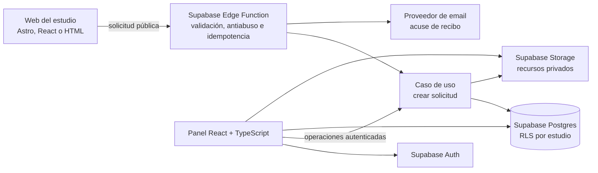

# Especificación de Inkendar

_Estado: especificación viva y fuente de verdad para alcance, comportamiento y progreso_

_Versión: 0.4.0_

_Última actualización: 2026-09-10_

_La fase anterior al desarrollo se define en [Plan de validación y lanzamiento](validation-and-launch-plan.md)._

_Ante cualquier contradicción con otros documentos o con las secciones heredadas de este archivo, prevalece la decisión vigente que aparece a continuación._

## Cómo mantener esta especificación

Este documento evoluciona con el producto. Ningún cambio de alcance, comportamiento, roles, datos, integración, precio o arquitectura se considera acordado hasta que quede reflejado aquí.

Cada modificación debe incluir:

1. el comportamiento vigente en la sección correspondiente;
2. la fecha y el estado del cambio;
3. el motivo y la evidencia que lo justifican en el registro de decisiones;
4. los criterios de aceptación afectados;
5. una decisión de arquitectura enlazada cuando cambien fronteras técnicas, persistencia, seguridad o proveedores;
6. el progreso actualizado únicamente después de obtener evidencia verificable.

Estados utilizados:

- `PROPOSED`: definido para discusión, todavía no ratificado;
- `ACCEPTED`: decisión vigente;
- `PLANNED`: incluido y ordenado, sin implementación;
- `IN_PROGRESS`: existe trabajo en curso comprobable;
- `CONNECTED`: proveedor conectado, pendiente de prueba extremo a extremo;
- `PASS`: aceptación verificada;
- `DEFERRED`: retirado del alcance actual sin descartarlo definitivamente;
- `DONE`: implementado, verificado y documentado.

Las correcciones editoriales pueden agruparse en una entrada. Los cambios de comportamiento deben tener una entrada propia con su motivo.

## Progreso vigente

| Área | Estado | Evidencia o siguiente gate |
|---|---|---|
| Landing comercial de Inkendar | `PASS` | La landing Astro funciona, pero es un activo de marketing independiente; su extracción de este proyecto está `PLANNED`. |
| Chat web en Chatwoot | `PASS` | Recepción y respuesta verificadas con datos sintéticos. |
| Instagram en Chatwoot | `PASS` | Recepción y respuesta por el canal original verificadas. |
| Facebook Messenger | `CONNECTED` | Falta la prueba bidireccional final. |
| Operación dentro de Inkendar | `PLANNED` | Chatwoot todavía no está oculto detrás del futuro panel. |
| PWA y autenticación | `PLANNED` | No existe todavía la aplicación privada. |
| Supabase y aislamiento multi-tenant | `PLANNED` | No existen proyecto, migraciones ni pruebas RLS en el repositorio. |
| Google Calendar y booking | `PLANNED` | No existe OAuth, disponibilidad, ofertas ni creación de eventos. |
| Galería, portfolios y publicación web | `PLANNED` | No existe todavía el almacenamiento, feed público ni componente de integración. |
| Piloto externo y disposición a pagar | `PLANNED` | No existe todavía evidencia de uso real autorizado ni pago. |

## Registro de decisiones

| Fecha | ID | Estado | Decisión | Motivo |
|---|---|---|---|---|
| 2026-09-02 | DEC-001 | `ACCEPTED` | Inkendar es el producto e Incamdi la agencia que lo implanta. | Separar la identidad del producto de la prestación profesional. |
| 2026-09-02 | DEC-002 | `ACCEPTED` | El MVP usa web, Instagram y Facebook mediante Chatwoot; WhatsApp queda fuera. | Web e Instagram pasaron el spike y WhatsApp Coexistence añadió una dependencia que bloqueaba la oferta. |
| 2026-09-02 | DEC-003 | `ACCEPTED` | Google Calendar es la agenda operativa y Supabase conserva el dominio. | Evitar construir una agenda propietaria antes de validar el recorrido comercial. |
| 2026-09-10 | DEC-004 | `ACCEPTED` | Chatwoot trabaja detrás de Inkendar y no es visible para owner ni artistas. | Ofrecer una experiencia única y conservar la opción de cambiar el proveedor de mensajería. |
| 2026-09-10 | DEC-005 | `ACCEPTED` | El owner opera canales, clientes, citas, calendarios, galería y portfolios; el artista solo consulta su agenda y el contexto necesario. | Centralizar la atención en el estudio y reducir permisos, formación y coste por agentes. |
| 2026-09-10 | DEC-006 | `ACCEPTED` | El cliente puede elegir entre huecos o recibir hasta tres opciones; las reservas provisionales duran 24 horas por defecto y son configurables. | Dar tiempo para decidir sin bloquear la agenda indefinidamente. |
| 2026-09-10 | DEC-007 | `ACCEPTED` | Si el owner preaprueba opciones, la elección confirma la cita; un hueco elegido libremente requiere aprobación del owner. | Mantener control humano y reducir pasos cuando la disponibilidad ya fue aprobada. |
| 2026-09-10 | DEC-008 | `ACCEPTED` | Inkendar gestiona solo la galería general y las imágenes por artista; el owner publica y los artistas no editan. | Permitir autonomía útil sin construir un CMS o editor de páginas completo. |
| 2026-09-10 | DEC-009 | `ACCEPTED` | Inkendar será una PWA y utilizará un único Supabase Cloud multi-tenant en producción. | Ofrecer móvil, tablet y escritorio con bajo coste operativo y aislamiento mediante Postgres/RLS. |
| 2026-09-10 | DEC-010 | `ACCEPTED` | Construir la aplicación como monolito modular TypeScript. | Mantiene dominio y proveedores desacoplados con una sola operación y fue ratificada antes de implementar. |
| 2026-09-10 | DEC-011 | `PROPOSED` | Hipótesis comercial: 149 €/mes, 690 € de implantación y 99 €/mes durante seis meses para pilotos. | Cubrir proveedores y soporte manteniendo un precio comparable con software gestionado del sector; debe validarse con estudios. |
| 2026-09-10 | DEC-012 | `ACCEPTED` | La landing comercial de Inkendar es independiente de la plataforma y de las webs de los estudios. | Su única función es dar a conocer Inkendar; no contiene ni publica datos de clientes. |
| 2026-09-10 | DEC-013 | `ACCEPTED` | Inkendar publica galerías mediante una interfaz de contenido de solo lectura compatible con webs nuevas y existentes. | Permitir vender una web cuando el estudio no la tiene y conservar Inkendar cuando ya dispone de una. |
| 2026-09-10 | DEC-014 | `ACCEPTED` | Todo comportamiento de producción se desarrolla con TDD mediante RED–GREEN–REFACTOR. | Proteger reglas de reservas, aislamiento, sincronización y permisos desde el inicio y evitar regresiones. |

La propuesta técnica completa y sus alternativas están en [Arquitectura de aplicación](../architecture/application-architecture.md).

## Historial de la especificación

| Fecha | Versión | Mejora o cambio | Por qué |
|---|---|---|---|
| 2026-09-10 | 0.4.0 | Se ratificó el monolito modular y TDD obligatorio para todo comportamiento de producción. | Fijar la disciplina técnica antes del primer slice de implementación. |
| 2026-09-10 | 0.3.0 | Se separó la landing comercial y se definió la publicación de galerías hacia webs nuevas o existentes. | Evitar mezclar marketing de Inkendar con contenido de estudios y hacer opcional la venta de una web. |
| 2026-09-10 | 0.2.0 | Se añadieron gobierno vivo, progreso, roles owner/artista, PWA, Chatwoot oculto, ofertas de fechas, caducidad, galerías y arquitectura propuesta. | Convertir las decisiones de producto en contratos rastreables antes de implementar. |
| 2026-09-02 | 0.1.0 | Se fijaron identidad, canales iniciales, salida de WhatsApp y Google Calendar como agenda operativa. | Ajustar el alcance a la evidencia obtenida en el piloto cero. |

## 0. Decisión vigente

### Identidad

- **Inkendar** es el producto.
- **Incamdi** es la agencia que lo configura, implanta y mantiene durante la validación.
- La landing comercial de Inkendar es un activo de marketing independiente y no forma parte de las webs ni de los datos de los estudios.
- La construcción o renovación de una web se vende aparte por Incamdi cuando el estudio no dispone de una.
- Si el estudio ya tiene web, se conecta a Inkendar sin sustituirla mediante un componente integrable o una API pública de contenido.

### Producto que validamos

El primer producto vendible será un **servicio gestionado**, no un SaaS autoservicio. Incamdi conectará para cada estudio:

- el chat de su web;
- su cuenta profesional de Instagram;
- su página de Facebook/Messenger;
- su Google Calendar.

Las conversaciones se atenderán íntegramente dentro del panel de Inkendar. Chatwoot funcionará como motor de mensajería oculto mediante API y webhooks. El owner no necesitará abrir Chatwoot para operar el estudio.

Inkendar será una PWA instalable y adaptada a móvil, tablet y escritorio. El owner administrará el estudio; los artistas tendrán una vista privada de solo lectura con su agenda y el contexto necesario para preparar cada tatuaje.

**WhatsApp queda fuera del MVP y de la promesa comercial actual.** Podrá reevaluarse posteriormente mediante WhatsApp Cloud API y Coexistence, pero no bloquea el piloto ni se anunciará como disponible.

La propuesta de valor vigente es:

> Inkendar reúne los mensajes de tu web, Instagram y Facebook en una sola bandeja y los conecta con tu Google Calendar para ayudarte a convertir consultas en citas sin perder contexto.

El recorrido principal es:

```text
Web / Instagram / Facebook
            ↓
     bandeja de Inkendar
            ↓
 owner clasifica y asigna
            ↓
 huecos u opciones de fecha
            ↓
 cliente elige / owner aprueba
            ↓
 cita y aviso de confirmación
```

### Evidencia actual

- **Web: PASS.** El widget de Chatwoot recibe mensajes y permite responder.
- **Instagram: PASS.** Los mensajes llegan y las respuestas regresan al canal original.
- **Facebook Messenger: CONNECTED / pendiente de prueba bidireccional final.**
- **Asignación: PARTIAL.** La atención funciona asignando manualmente la conversación; la asignación automática continúa pendiente de localizar y validar.
- **WhatsApp: DEFERRED.** El flujo manual exige un número dedicado o migrado; conservar el número en la aplicación requiere Coexistence. Se retira del MVP.
- **Google Calendar: PLANNED.** La integración todavía no está implementada ni validada.

Un canal no pasa a `PASS` por estar conectado: debe demostrarse recepción y respuesta de extremo a extremo con datos sintéticos.

### Alcance funcional del MVP gestionado

1. **Alta operada:** Incamdi configura manualmente el espacio aislado del estudio, agentes, bandejas y conexiones.
2. **Chat web:** mensaje entrante y respuesta bidireccional mediante widget en una web HTTPS.
3. **Instagram:** recepción y respuesta mediante la conexión oficial disponible en Chatwoot.
4. **Facebook Messenger:** recepción y respuesta desde la página autorizada por el estudio.
5. **Panel único:** el owner recibe y responde mensajes desde Inkendar; Chatwoot permanece oculto.
6. **Roles:** el owner opera todo el estudio. El artista solo consulta sus citas y el contexto necesario, sin responder clientes ni modificar imágenes.
7. **Google OAuth centralizado:** el owner conecta una cuenta Google del estudio con acceso a un calendario separado por artista y permisos mínimos.
8. **Disponibilidad:** Inkendar combina jornada, zona horaria, duración, márgenes, bloqueos provisionales y `freeBusy`; no muestra títulos ni descripciones de eventos existentes.
9. **Opciones preaprobadas:** el owner puede enviar hasta tres fechas. Se reservan provisionalmente durante 24 horas por defecto; el plazo es configurable por estudio.
10. **Elección libre:** el cliente puede consultar huecos de un artista mediante un enlace seguro. El hueco elegido queda pendiente hasta la aprobación del owner.
11. **Confirmación:** una opción preaprobada se confirma al elegirla. Una opción libre requiere visto bueno del owner. En ambos casos Inkendar vuelve a comprobar disponibilidad antes de confirmar.
12. **Caducidad:** al vencer el plazo, se liberan los bloqueos y se avisa al cliente de que los horarios pueden ofrecerse a otra persona.
13. **Notificaciones:** confirmaciones, rechazos y caducidades se envían por el canal original cuando sea posible, con correo como respaldo configurado.
14. **Contexto mínimo:** canal y conversación de origen, contacto disponible, resumen, artista, duración, referencias, oferta, cita e identificadores externos.
15. **Publicación web:** el owner administra en Inkendar la galería general y las imágenes asociadas a cada artista. Inkendar publica únicamente el contenido aprobado mediante un feed público de solo lectura. Una web creada por Incamdi o una web existente consumen el mismo contrato.
16. **Privacidad y aislamiento:** cada estudio mantiene separados conversaciones, conexiones, credenciales, calendarios y datos.
17. **Recuperación:** existen procedimientos para permisos caducados, reconexiones, revocación y mensajes, imágenes o reservas fallidos.

Los permisos previstos de Google Calendar son los mínimos que permitan consultar disponibilidad y gestionar eventos autorizados. Los tokens se almacenan únicamente en backend y nunca aparecen en el navegador, logs o documentación.

### Fuentes de verdad por dato

- **Chatwoot:** conversaciones y mensajes durante el MVP gestionado.
- **Google Calendar:** disponibilidad y evento operativo de la cita.
- **Inkendar/Supabase:** estudios, membresías, reglas de disponibilidad, relaciones entre conversación, caso y evento, y auditoría del dominio.

No habrá dos fuentes editables del mismo mensaje o evento. Inkendar almacenará identificadores externos y estado de sincronización, no copias divergentes presentadas como autoritativas.

El caso de tatuaje continúa separado de la cita: un caso puede requerir varias sesiones y una conversación puede existir sin haberse convertido todavía en caso.

### Contrato entre Inkendar y las webs de estudios

Inkendar actúa como fuente de contenido para galerías, no como editor visual de páginas. El owner realiza todas las escrituras desde la PWA autenticada. Las webs solo reciben contenido marcado como publicado.

Existen dos vías comerciales:

1. **Estudio sin web:** Incamdi entrega una web basada en una plantilla adaptable, conectada al feed público de Inkendar.
2. **Estudio con web:** se instala un web component agnóstico del framework o se consume el feed mediante una integración a medida. No es necesario migrar ni rehacer la web.

El contrato público mínimo contiene:

```text
StudioGallery
├── studio_public_slug
├── updated_at
├── gallery_images[]
│   ├── public_id
│   ├── image_variants
│   ├── alt_text
│   ├── position
│   └── published_at
└── artists[]
    ├── artist_public_slug
    ├── display_name
    └── portfolio_images[]
```

El feed no expone usuarios, clientes, casos, conversaciones, calendarios, originales privados ni identificadores internos. Se sirve mediante CDN, admite invalidación al publicar y aplica límites de tráfico. El web component no contiene credenciales administrativas.

La primera integración ofrece dos modos:

- **Web component:** instalación rápida en HTML, WordPress o constructores que admitan scripts; Inkendar controla el comportamiento del bloque y la web puede adaptar variables visuales permitidas.
- **API/feed:** integración para webs a medida; el estudio conserva su diseño y el desarrollador representa los datos publicados.

El flujo es:

```text
Owner publica en Inkendar
          ↓
Supabase guarda original privado y variantes públicas
          ↓
Servicio público entrega solo el contenido publicado
          ↓
Web nueva de Incamdi o web existente del estudio
```

### Criterios críticos vigentes

#### Disponibilidad sin revelar eventos privados

```gherkin
Given un owner que conectó la cuenta Google del estudio y asignó un calendario a un artista
When consulta disponibilidad para una duración concreta
Then Inkendar devuelve únicamente intervalos candidatos libres
And respeta zona horaria, jornada, duración, márgenes y bloqueos provisionales
And no expone títulos ni descripciones de eventos existentes
```

#### Opciones preaprobadas

```gherkin
Given que el owner ofreció hasta tres fechas con una caducidad visible
When el cliente elige una antes del vencimiento
Then Inkendar vuelve a comprobar que continúa libre
And confirma un único evento en el calendario del artista
And libera inmediatamente las demás opciones
And avisa al cliente por el canal configurado
```

#### Caducidad

```gherkin
Given una oferta provisional sin elección del cliente
When alcanza su fecha de vencimiento
Then Inkendar libera todas sus opciones de forma idempotente
And permite ofrecérselas a otros clientes
And informa al cliente de que la oferta ha caducado
```

#### Elección libre pendiente de aprobación

```gherkin
Given un cliente con un enlace seguro vigente a los huecos de un artista
When selecciona un intervalo que no fue preaprobado por el owner
Then Inkendar crea una reserva provisional y avisa al owner
And no comunica una cita confirmada hasta recibir su aprobación
And vuelve a comprobar Google Calendar antes de confirmar
```

#### Vista del artista

```gherkin
Given un artista autenticado
When abre su agenda
Then solo ve sus citas y el contexto necesario para preparar el tatuaje
And no puede leer conversaciones ni citas de otros artistas
And no puede responder clientes, confirmar citas o modificar imágenes
```

#### Publicación en una web existente

```gherkin
Given un estudio que ya dispone de una web compatible
And el owner publicó imágenes desde Inkendar
When la web solicita la galería mediante el componente o el feed público
Then recibe únicamente imágenes publicadas y optimizadas de ese estudio
And no recibe datos privados ni credenciales
And una imagen retirada deja de aparecer después de invalidar la caché acordada
```
#### Galería y portfolios

```gherkin
Given un owner autenticado que sube una imagen válida
When asigna la imagen a la galería o al portfolio de un artista y la publica
Then Inkendar valida formato, peso y resolución
And elimina metadatos privados y genera variantes optimizadas
And la web muestra la versión publicada en el orden elegido
```

### Modelo de entrega y gates

El onboarding será manual. Se empezará con un estudio y se ampliará como máximo a tres–cinco pilotos después de medir:

- tiempo total de configuración;
- tiempo de soporte mensual;
- incidencias de permisos o reconexión;
- mensajes gestionados y consultas convertidas en cita;
- disposición a continuar pagando.

Gates iniciales para ampliar:

- configuración repetible en 90 minutos o menos;
- soporte ordinario de 30 minutos o menos por estudio y mes;
- los tres canales anunciados pasan la prueba bidireccional;
- ninguna exposición de datos entre estudios;
- Google Calendar consulta y crea citas sin confirmaciones falsas;
- al menos un estudio utiliza el recorrido con datos reales autorizados y acepta pagar.

### Orden inmediato

1. Completar la prueba bidireccional de Facebook Messenger.
2. Definir el contrato técnico y las pruebas RED del primer slice sobre la [arquitectura aceptada](../architecture/application-architecture.md).
3. Verificar privacidad, términos y tratamiento de datos antes de conversaciones reales.
4. Cerrar los contratos de dominio, API y modelo de datos del primer slice.
5. Crear el proyecto Supabase, las migraciones iniciales y las pruebas de aislamiento RLS.
6. Crear el proyecto de Google Cloud, consentimiento OAuth y credenciales de prueba.
7. Implementar conexión central, revocación y asignación de calendarios por artista.
8. Implementar disponibilidad, ofertas, bloqueos, caducidad y confirmación idempotente.
9. Integrar las conversaciones de Chatwoot dentro del panel de Inkendar.
10. Probar conversación → propuesta → elección → confirmación → evento → aviso.
11. Añadir la vista de solo lectura del artista y la gestión de imágenes por el owner.
12. Implementar el feed público y el web component; probarlos en una web de Incamdi y en una web externa mínima.
13. Extraer la landing comercial de Inkendar a un proyecto y despliegue independientes.
14. Medir un onboarding completo antes de incorporar estudios adicionales.

### Fuera del MVP vigente

- WhatsApp y cualquier promesa de Coexistence;
- conexiones no oficiales mediante sesiones de WhatsApp Web;
- reserva completamente automática o decidida por IA;
- una agenda propietaria que sustituya Google Calendar;
- Apple Calendar, Outlook y otros proveedores;
- pagos, consentimientos médicos, campañas, POS, inventario, contabilidad;
- onboarding y billing autoservicio;
- aplicación móvil nativa y self-hosting.

## Contexto anterior y backlog

Las secciones siguientes conservan decisiones de dominio, seguridad y capacidades candidatas útiles, pero su antiguo orden de MVP queda **sustituido** por la decisión vigente de la sección 0. En particular, toda referencia a WhatsApp dentro del MVP, agenda nativa como primera opción o Instagram fuera de la primera oferta se interpreta como backlog histórico.

## 1. Resumen ejecutivo

El producto combina una web pública para captar solicitudes con un workspace privado para convertirlas en casos de tatuaje organizados, asignarlos a artistas y llevarlos hasta una cita.

La primera versión comercial no depende de Instagram, WhatsApp ni de aprobaciones de Meta. Debe poder venderse y aportar valor con este recorrido completo:

```text
Web del estudio → solicitud con referencias → caso de tatuaje
              → revisión y asignación → propuesta de cita
              → señal registrada → agenda y vista “Hoy”
```

Instagram y WhatsApp Business siguen siendo una prioridad del producto. Su viabilidad se comprueba primero con el piloto cero del fundador, pero solo se incorporan al producto vendible después de validar el núcleo con un estudio real. Esta separación permite corregir la promesa comercial antes de captar estudios sin convertir las aprobaciones de Meta en dependencia del primer MVP.

## 2. Producto que se vende

No se vende una web aislada ni un calendario genérico. Se vende:

> Una web que consigue solicitudes y un sistema privado para convertirlas en trabajo organizado.

La oferta comercial combina:

- web del estudio con portfolio, artistas, contenido local y formulario de solicitud;
- workspace privado con casos, clientes, referencias, asignaciones, citas y vista diaria;
- configuración inicial realizada por nosotros;
- mantenimiento y soporte mediante suscripción por estudio;
- ninguna comisión porcentual sobre el precio del tatuaje o la señal.

### Cliente objetivo inicial

- estudio con entre 2 y 6 artistas;
- propietario o manager que participa en la gestión de solicitudes;
- reservas repartidas entre mensajes, formularios, calendarios o papel;
- volumen suficiente para notar el coste administrativo;
- disposición para adoptar una web nueva o mejorar la actual.

### Hipótesis comercial inicial

- instalación incluida dentro del proyecto web o cobrada como trabajo inicial;
- precio fundador orientativo: 49 EUR/mes por estudio para hasta 3 artistas;
- precio objetivo posterior: 79–99 EUR/mes según costes y uso medidos;
- integraciones con costes variables de terceros se mostrarán por separado;
- los importes son hipótesis de validación, no contratos permanentes del producto.

## 3. Principios del producto

1. El caso de tatuaje, no la cita, es la unidad principal.
2. Una solicitud personalizada nunca ocupa agenda sin revisión humana.
3. Brief, referencias, artista, citas y señal permanecen en el mismo contexto.
4. El cliente no necesita instalar una aplicación ni crear una cuenta.
5. El estudio controla aceptación, presupuesto y disponibilidad.
6. El producto debe funcionar bien en móvil y tablet dentro del estudio.
7. Cada estudio está aislado y conserva capacidad de exportar sus datos.
8. Un fallo de red no debe obligar a repetir un formulario completo.
9. Las integraciones externas mejoran el producto, pero no gobiernan el dominio.
10. No se anunciará como disponible una función que solo exista como demo o placeholder.

## 4. Actores y permisos

### Operador de plataforma

Da de alta estudios, configura la integración de su web y diagnostica incidencias técnicas. No accede por defecto al contenido privado de clientes.

### Owner

Administra el estudio, miembros, artistas y configuración. Puede ver y modificar todos los casos y citas del estudio.

### Manager

Gestiona solicitudes, clientes, artistas, agenda y señales. No puede transferir la propiedad del estudio ni acceder a secretos de plataforma.

### Artist

Ve sus casos y citas asignados, elementos compartidos y la vista “Hoy”. Puede añadir notas y recursos según permisos, pero no ve automáticamente trabajo privado de otros artistas.

### Cliente final

Envía información desde la web o la proporciona presencialmente. No inicia sesión en el MVP.

## 5. Contrato de dominio

- **Cliente:** persona que puede tener varios casos a lo largo del tiempo.
- **Caso de tatuaje:** proyecto creativo y operativo con brief, referencias, asignación y progreso.
- **Cita:** bloque de agenda asociado a un caso y un artista. Un caso puede tener varias.
- **Recurso:** referencia, fotografía de zona, diseño o fotografía de progreso.
- **Nota interna:** información visible únicamente para miembros autorizados.
- **Señal:** compromiso económico de una cita; en el MVP se registra, pero no se procesa.
- **Origen:** `website` o `in_studio` en el MVP; `instagram` y `whatsapp` se incorporan en la fase conectada.

### Estados del caso

`new`, `needs_info`, `reviewing`, `approved`, `declined`, `in_progress`, `completed`, `archived`.

### Estados de cita

`tentative`, `awaiting_deposit`, `confirmed`, `completed`, `cancelled`, `no_show`.

### Estados de señal

`not_required`, `pending`, `paid`, `applied`, `forfeited`, `refunded`.

Los estados de caso, cita y señal son independientes. Una señal pendiente no puede representarse como cita confirmada.

## 6. MVP vendible: alcance actual

### MVP-01 — Alta operada de estudios

El operador puede crear un estudio, owner, artistas e integración web. El alta puede ser manual durante los primeros clientes; no se necesita onboarding autoservicio ni facturación automática.

### MVP-02 — Formulario integrado en la web

Cada web puede enviar solicitudes a una entrada pública identificada sin usar credenciales administrativas.

El brief mínimo recoge:

- nombre;
- correo o teléfono;
- idea del tatuaje;
- zona y lado del cuerpo cuando aplique;
- tamaño aproximado con ejemplos comprensibles;
- artista preferido o sin preferencia;
- referencias opcionales;
- aceptación de privacidad.

Los campos de estilo, color, cover-up, presupuesto y disponibilidad pueden mostrarse condicionalmente. La primera versión utiliza una plantilla configurable durante el onboarding; no necesita un constructor libre de formularios.

### MVP-03 — Formulario resistente

- funciona desde móvil sin cuenta;
- guarda borrador local mientras se completa;
- valida antes de enviar;
- muestra progreso de archivos;
- permite reintentar una subida o envío;
- usa una clave de idempotencia para evitar casos duplicados;
- confirma recepción solo después de guardar datos y referencias necesarias.

### MVP-04 — Acuse de recibo

Tras una solicitud válida, el cliente ve una confirmación en la web y recibe un correo transaccional con próximos pasos. El MVP no promete una bandeja de correo bidireccional completa.

### MVP-05 — Captura presencial

Owner, manager o artist puede crear un caso desde móvil o tablet mientras habla con el cliente. El sistema busca primero clientes existentes por nombre, teléfono o correo y registra origen `in_studio` y miembro creador.

### MVP-06 — Bandeja de solicitudes

Owner y manager ven todas las solicitudes. Artist ve las asignadas o compartidas. Se puede filtrar por estado, artista, origen, fecha, sin asignar e información pendiente.

Acciones mínimas:

- abrir;
- asignar;
- marcar `needs_info`;
- aprobar;
- rechazar;
- archivar.

### MVP-07 — Ficha única del caso

La ficha reúne:

- cliente y contacto;
- brief;
- referencias;
- artista asignado;
- estado;
- notas internas;
- citas;
- señal;
- historial con autor y fecha.

### MVP-08 — Clientes e historial

El sistema busca por nombre, teléfono y correo dentro del estudio. Un cliente puede tener varios casos y citas. Miembros autorizados pueden corregir datos y combinar duplicados sin borrar el historial.

### MVP-09 — Recursos privados

- imágenes en almacenamiento privado;
- acceso mediante URLs temporales;
- aislamiento por estudio y caso;
- tipos y tamaños limitados;
- estados de subida y error visibles;
- eliminación lógica y auditoría básica.

### MVP-10 — Agenda nativa

- vistas día y semana;
- creación, edición y cancelación manual;
- caso, artista, inicio, fin y estado obligatorios;
- varias citas por caso;
- prevención de solapamientos del mismo artista;
- ninguna solicitud personalizada reserva automáticamente.

### MVP-11 — Registro manual de señal

Se registra si es necesaria, importe, vencimiento, estado y quién realizó el cambio. No se almacenan tarjetas ni datos bancarios y no se mueve dinero.

### MVP-12 — Vista “Hoy”

Cada artista ve sus citas del día ordenadas con cliente, horario, resumen, zona, tamaño, referencias, estado de señal e información pendiente. Puede abrir el caso con una acción.

### MVP-13 — Búsqueda y exportación

Owner y manager pueden buscar clientes y casos y exportar clientes, casos, citas y referencias de recursos en un formato común. La exportación debe respetar permisos y no incluir secretos.

### MVP-14 — Notificaciones operativas mínimas

El estudio recibe aviso cuando entra una solicitud nueva. Se admiten notificaciones dentro del panel y correo; push móvil, SMS y automatizaciones avanzadas quedan fuera.

### MVP-15 — Seguridad multi-tenant

- Supabase Auth para usuarios del estudio;
- `studio_id` en datos de negocio;
- RLS basada en membresía y rol;
- ninguna operación confía en un `studio_id` elegido por el navegador;
- recursos privados y URLs firmadas;
- claves de integración y secretos solo en backend;
- pruebas explícitas de acceso permitido y denegado;
- auditoría de cambios relevantes.

## 7. Fuera del MVP vendible

No bloquean la primera venta:

- Instagram y WhatsApp Business;
- Chatwoot desplegado o contratado;
- procesamiento de pagos con Stripe;
- firma y cuestionario de consentimiento;
- sincronización Google/Apple Calendar;
- portal completo del cliente;
- constructor libre de formularios;
- onboarding y billing autoservicio;
- SMS, campañas y marketing;
- marketplace;
- generación de diseños o presupuesto final por IA;
- inventario, POS, comisiones y contabilidad;
- aplicación móvil nativa;
- modo offline completo;
- self-hosting de Supabase.

## 8. Evolución posterior

### Fase 1 — Estudio conectado

Objetivo: incorporar conversaciones sin cambiar el canal utilizado por el cliente.

- Chatwoot como primera opción de motor de mensajería;
- un espacio/cuenta de Chatwoot por estudio;
- conexión de Instagram profesional;
- conexión de WhatsApp Business mediante Embedded Signup y Coexistence cuando sea elegible;
- webhooks para avisar al dominio de conversaciones y mensajes;
- conversación pendiente que se vincula a un cliente/caso o se convierte en uno nuevo;
- respuesta desde nuestro panel por el canal original;
- texto, imágenes, errores y estados reales del proveedor;
- reglas de ventana de respuesta y plantillas de WhatsApp visibles.

Antes de comprometer esta fase se debe superar un spike con cuentas reales de prueba que confirme Instagram, WhatsApp Coexistence, archivos, webhooks, aislamiento, API, licenciamiento y coste de Chatwoot. Si Chatwoot no supera el spike, se conserva el mismo puerto de mensajería y se implementa un adaptador oficial de Meta sin alterar el dominio.

Chatwoot será fuente de verdad de conversaciones y mensajes. Supabase conservará estudio, cliente, caso, citas y las referencias necesarias para relacionarlos; no existirán dos fuentes editables del mismo mensaje.

### Fase 2 — Reserva y confianza

- enlaces seguros para completar información pendiente;
- Stripe Connect para señales;
- recordatorios configurables;
- políticas de cancelación y reprogramación;
- consentimientos versionados según región;
- sincronización con calendarios externos;
- lista de espera y huecos liberados;
- fotografías de progreso y proyectos multisessión mejorados.

### Fase 3 — Operación y crecimiento

- métricas de conversión, respuesta, no-shows y carga por artista;
- múltiples ubicaciones;
- aftercare y solicitud de fotografías curadas;
- automatizaciones de reseñas;
- caja, comisiones e inventario solo si los pilotos lo justifican;
- IA limitada a clasificación, extracción y resumen, nunca a aceptar un encargo o fijar el precio final sin aprobación humana.

## 9. Arquitectura del MVP



### Componentes previstos

```text
apps/
  dashboard/              # Panel React/TypeScript
packages/
  intake-widget/          # Formulario integrable o web component
  contracts/              # Schemas y tipos compartidos
supabase/
  migrations/             # Esquema, constraints y RLS
  functions/public-intake/
  functions/staff-intake/
  functions/notifications/
  tests/                  # Contratos y aislamiento
```

### Datos del MVP

- `studios`
- `profiles`
- `studio_memberships`
- `artist_profiles`
- `clients`
- `tattoo_cases`
- `case_notes`
- `case_media`
- `appointments`
- `appointment_deposits`
- `web_integration_keys`
- `outbound_notifications`
- `audit_events`

Las tablas `channel_connections`, `conversations`, `conversation_messages` y `message_attachments` llegan con la fase conectada.

## 10. Requisitos no funcionales

### Privacidad y seguridad

- recoger solo datos necesarios para evaluar y reservar;
- no recoger historial médico en el MVP;
- política de privacidad visible y consentimiento registrado;
- aislamiento RLS comprobado en base de datos y almacenamiento;
- logs sin brief, imágenes, tokens ni contacto completo;
- exportación y proceso operativo de eliminación;
- retención configurable antes de incorporar consentimientos médicos.

### Fiabilidad

- solicitudes públicas idempotentes;
- borradores recuperables;
- reintentos de archivos y notificaciones;
- errores visibles, sin éxito falso;
- copias de seguridad conforme al plan de Supabase elegido;
- monitorización de funciones y fallos de notificación antes del primer cliente de pago.

### Experiencia

- tareas críticas utilizables desde 320 px;
- teclado, contraste y estados que no dependan solo del color;
- cliente sin cuenta ni instalación;
- “Hoy”, nueva solicitud y ficha del caso accesibles en un máximo de una navegación desde la portada correspondiente.

## 11. Criterios de aceptación principales

### Solicitud pública

```gherkin
Given una integración web activa para un estudio
When un cliente envía un brief válido con dos referencias
Then se crea un único caso new en el estudio correcto
And las referencias quedan privadas y vinculadas
And se confirma recepción al cliente
And no se crea ninguna cita
```

### Reintento idempotente

```gherkin
Given una solicitud cuyo resultado no llegó al navegador
When el formulario repite el envío con la misma clave
Then el sistema devuelve el caso ya creado
And no duplica cliente, caso ni referencias
```

### Captura presencial

```gherkin
Given un artista autenticado
When crea un caso presencial para un cliente existente
Then el caso pertenece al estudio derivado de su membresía
And queda vinculado al cliente encontrado
And registra origen y creador
And no ocupa agenda automáticamente
```

### Aprobación y cita

```gherkin
Given un caso aprobado con artista asignado
When un manager crea una cita sin señal requerida en un intervalo libre
Then la cita queda confirmed y vinculada al caso
And aparece en la agenda y en “Hoy” del artista
```

### Señal pendiente

```gherkin
Given una cita que requiere señal
When se crea con la señal pendiente
Then la cita queda awaiting_deposit
And no se presenta como confirmada
And muestra importe y vencimiento
```

### Conflicto de agenda

```gherkin
Given un artista con una cita existente
When se intenta crear otra cita solapada
Then la operación se rechaza sin modificar la agenda
And se identifica el conflicto
```

### Aislamiento

```gherkin
Given dos estudios diferentes
When un miembro intenta leer o modificar un caso o recurso ajeno
Then la operación se deniega
And no se revela si el recurso existe
```

### Recuperación del formulario

```gherkin
Given un cliente que completó parte del formulario
When pierde conexión y vuelve a abrirlo en el mismo dispositivo
Then recupera los campos guardados
And puede reintentar archivos fallidos sin repetir el resto
```

## 12. Definition of Done comercial

El MVP puede venderse cuando:

- se puede dar de alta manualmente un estudio y sus artistas;
- una web real puede integrarse sin credenciales administrativas;
- el flujo solicitud → revisión → asignación → cita → “Hoy” funciona de extremo a extremo;
- formulario y panel funcionan en móvil;
- las imágenes son privadas y recuperables;
- los permisos multi-tenant tienen pruebas allow/deny;
- errores de solicitud y notificación están monitorizados;
- existe copia de seguridad conforme al plan contratado;
- owner puede exportar sus datos esenciales;
- existen política de privacidad, términos básicos y canal de soporte;
- onboarding y recuperación de acceso están documentados;
- todas las funciones anunciadas al cliente funcionan en producción;
- un estudio piloto lo ha usado con solicitudes reales y acepta continuar pagando.

## 13. Métricas para validar el producto

- estudios que completan onboarding y reciben su primera solicitud;
- solicitudes revisadas desde el panel;
- tiempo hasta primera revisión;
- porcentaje de briefs que requieren información adicional;
- solicitudes aprobadas y convertidas en cita;
- citas con señal registrada;
- casos del día con referencias e información completas;
- tiempo administrativo percibido antes y después;
- intención de pago y continuidad tras el piloto.

No se utilizarán métricas de vanidad como número de pantallas, campos o automatizaciones creadas.

## 14. Orden de implementación

0. Ejecutar el [piloto cero técnico](founder-pilot-zero-plan.md) y obtener `PASS`, o corregir explícitamente el alcance tras `PARTIAL/FAIL`.
1. Completar el gate del plan de validación con al menos un estudio piloto cualificado.
2. Contratos, esquema mínimo y pruebas de aislamiento RLS.
3. Alta manual de estudio, usuarios y artistas.
4. Formulario público resistente y creación idempotente de caso.
5. Bandeja, ficha del caso, notas e imágenes privadas.
6. Captura presencial y deduplicación de clientes.
7. Estados, asignación y auditoría.
8. Agenda, prevención de conflictos y vista “Hoy”.
9. Registro manual de señal.
10. Notificaciones, búsqueda y exportación.
11. Hardening móvil, monitorización, privacidad y onboarding.
12. Piloto real y correcciones necesarias para cobrar.
13. Convertir el resultado del spike de canales en integración de producción y completar las revisiones necesarias.
